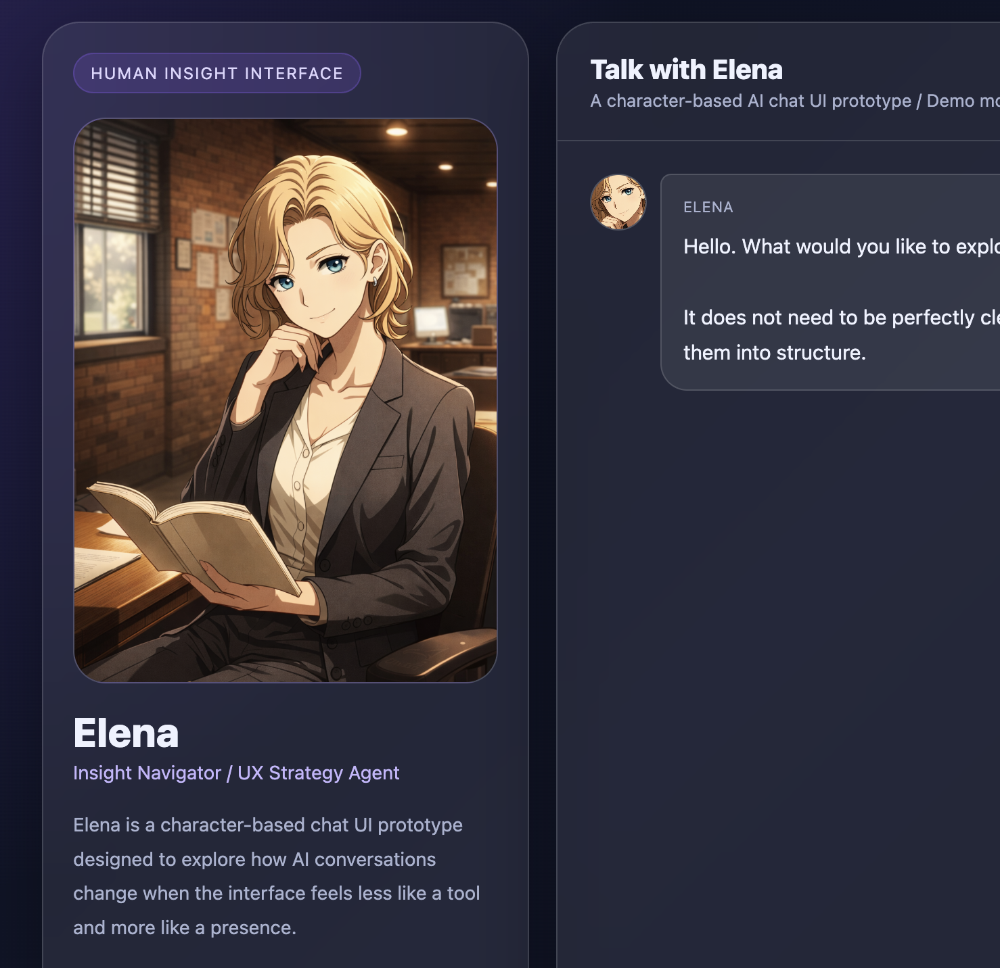
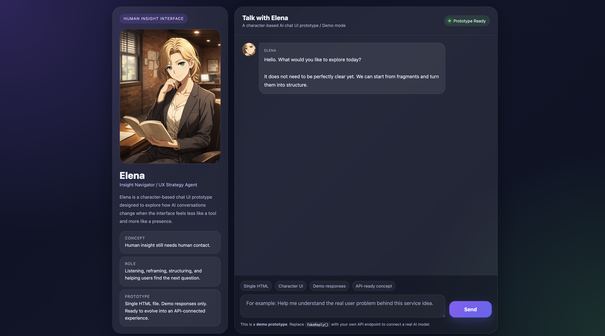
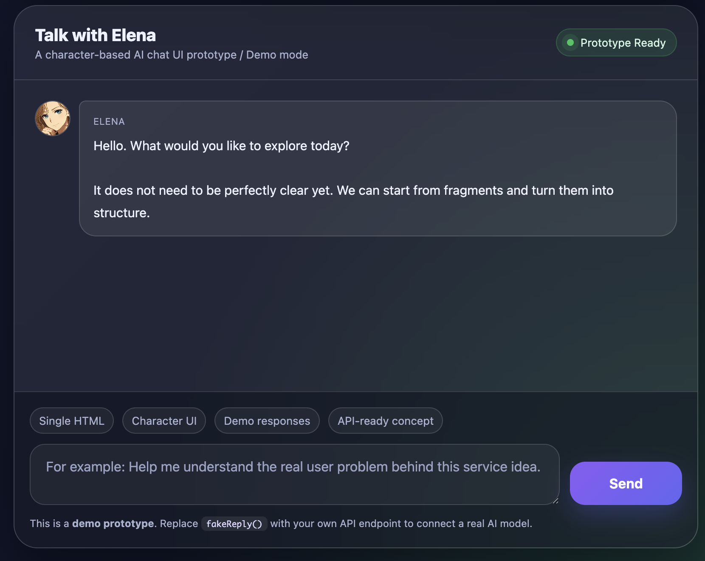

# Elena Chat UI Prototype


A character-based AI chat interface prototype built with pure HTML, CSS, and JavaScript.

Instead of embedding GPTs directly, this project explores a different question:

> What happens when AI feels less like a tool and more like a presence?

The concept was inspired by discussions around AI interviews, UX research, and the idea that:

> “Human insight still needs human contact.”

---

## Preview

Elena is a fictional UX strategy character designed to explore:
- conversational UX
- emotional interface design
- character-based AI interaction
- trust and presence in AI communication

This prototype currently uses demo responses only.

---

## Features

- Single HTML file
- Character profile sidebar
- Chat-style conversation UI
- Character avatar inside messages
- Responsive layout
- Demo response system
- API-ready structure

---

## Tech Stack

- HTML
- CSS
- Vanilla JavaScript

No frameworks.
No build tools.
Just a lightweight prototype.

---

## Project Structure

```text
/
├── index.html
├── README.md
└── assets/
    └── elena_ig.png
```
---
## Why I Built This

AI interviews can collect information efficiently.

But people often communicate differently with AI:

- more logical
- less emotional
- less spontaneous

Many important insights still emerge through:

- trust
- emotional nuance
- pauses
- side conversations
- human presence

This project explores whether a character-oriented interface can make AI interaction feel more natural and emotionally open.

---

## Future Plans

- OpenAI API integration
- Multiple character modes
- Typing animation
- Voice interaction
- Memory system
- Soft Human Edition 🌸
- Real-time character animation
- Emotion-aware interaction
- Expression-driven UI responses
- Voice and presence-based communication

---

##　Screenshot





---
## Author

Designed and developed by Yutaka Morita.

Exploring:

- UX
- AI
- character interaction
- design systems
- human-centered AI experiences

---

## License

MIT License
